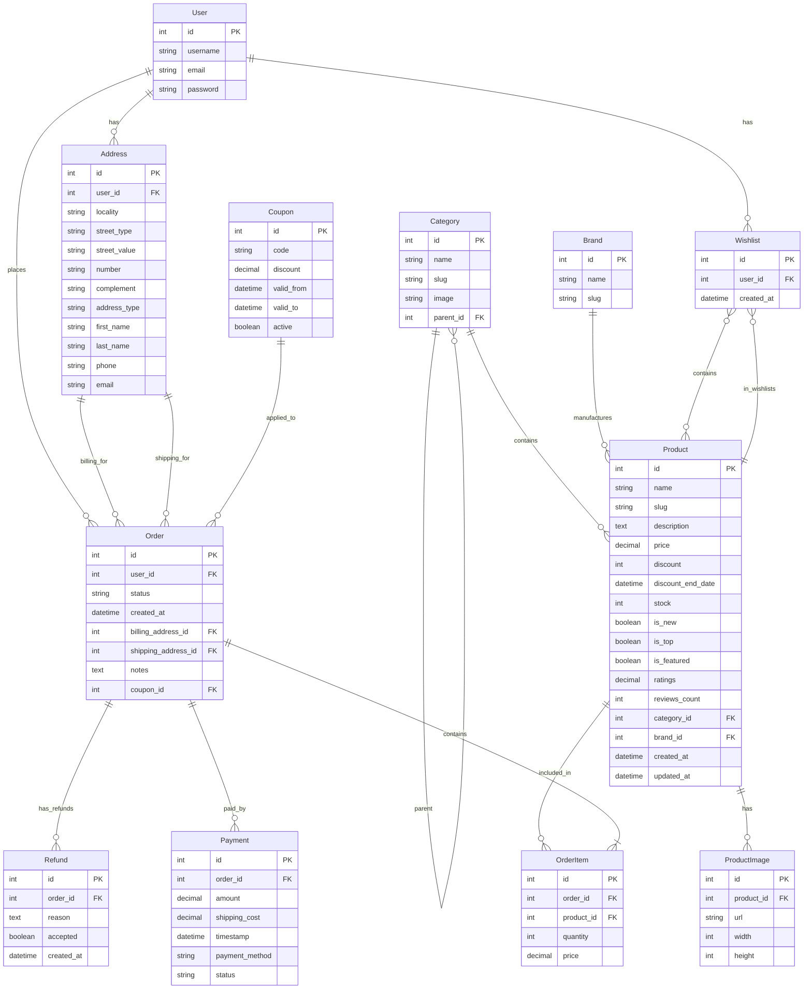

# Esquema de Base de Datos

Este documento representa la estructura de la base de datos del backend utilizando un diagrama entidad-relación (ER) en formato Mermaid.

```mermaid
erDiagram
    User ||--o{ Wishlist : has
    User ||--o{ Address : has
    User ||--o{ Order : places

    Category ||--o{ Category : parent
    Category ||--o{ Product : contains

    Brand ||--o{ Product : manufactures

    Product ||--o{ ProductImage : has
    Product ||--o{ OrderItem : included_in
    Product ||--o{ Wishlist : in_wishlists

    Wishlist }o--o{ Product : contains

    Address ||--o{ Order : billing_for
    Address ||--o{ Order : shipping_for

    Coupon ||--o{ Order : applied_to

    Order ||--|{ OrderItem : contains
    Order ||--o{ Payment : paid_by
    Order ||--o{ Refund : has_refunds

    User {
        int id PK
        string username
        string email
        string password
    }

    Category {
        int id PK
        string name
        string slug
        string image
        int parent_id FK
    }

    Brand {
        int id PK
        string name
        string slug
    }

    Product {
        int id PK
        string name
        string slug
        text description
        decimal price
        int discount
        datetime discount_end_date
        int stock
        boolean is_new
        boolean is_top
        boolean is_featured
        decimal ratings
        int reviews_count
        int category_id FK
        int brand_id FK
        datetime created_at
        datetime updated_at
    }

    ProductImage {
        int id PK
        int product_id FK
        string url
        int width
        int height
    }

    Wishlist {
        int id PK
        int user_id FK
        datetime created_at
    }

    Address {
        int id PK
        int user_id FK
        string locality
        string street_type
        string street_value
        string number
        string complement
        string address_type
        string first_name
        string last_name
        string phone
        string email
    }

    Coupon {
        int id PK
        string code
        decimal discount
        datetime valid_from
        datetime valid_to
        boolean active
    }

    Order {
        int id PK
        int user_id FK
        string status
        datetime created_at
        int billing_address_id FK
        int shipping_address_id FK
        text notes
        int coupon_id FK
    }

    OrderItem {
        int id PK
        int order_id FK
        int product_id FK
        int quantity
        decimal price
    }

    Payment {
        int id PK
        int order_id FK
        decimal amount
        decimal shipping_cost
        datetime timestamp
        string payment_method
        string status
    }

    Refund {
        int id PK
        int order_id FK
        text reason
        boolean accepted
        datetime created_at
    }
```
